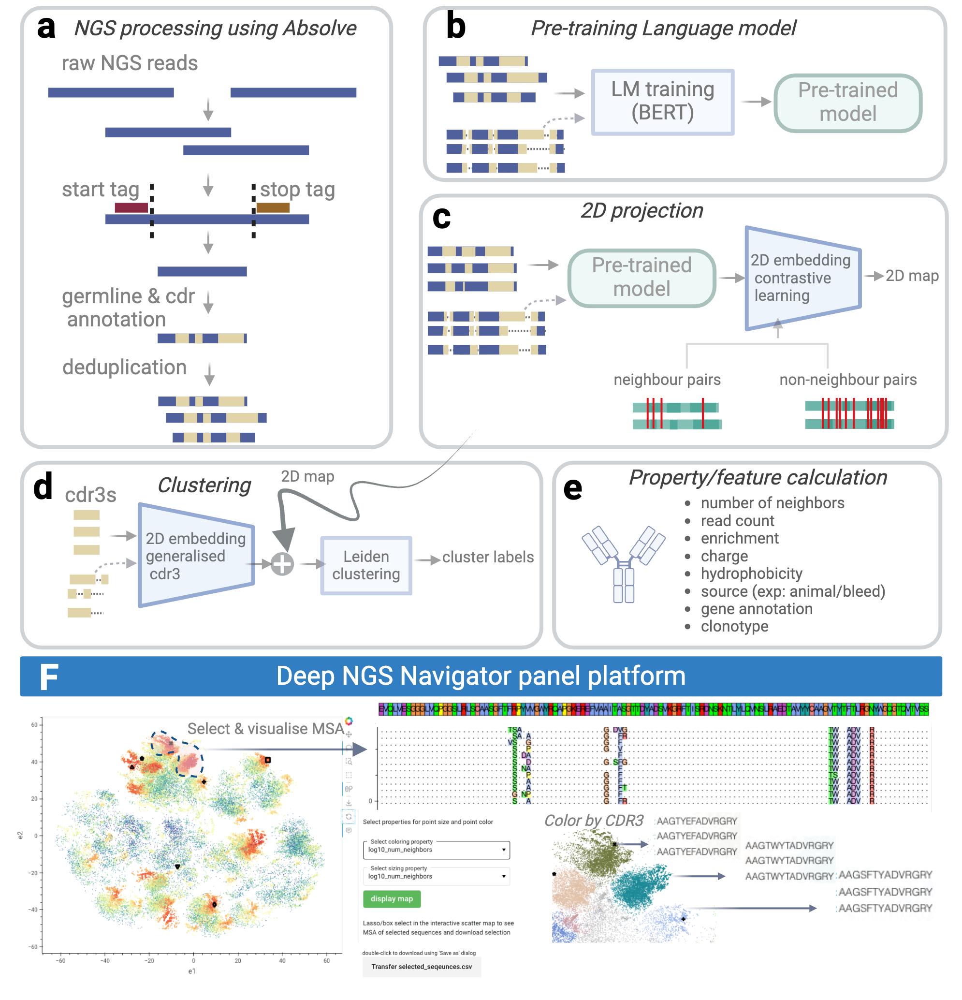

# DeepNGS Navigator

Welcome to DeepNGS Navigator
DeepNGS Navigator is a computational framework that leverages language models and contrastive learning to transform high-dimensional antibody repertoire data into intuitive two-dimensional maps. This approach not only facilitates the exploration and interpretation of complex datasets but also highlights evolutionary relationships among them.
The method utilizes a BERT-type language model to distill evolutionary and functional relationships of input sequences. Then projected to 2D maps using contrastive learning techniques, inspired by frameworks like SimCLR and t-SimCNE, tailored specifically for antibody sequences. We employ adaptive similarity thresholding to identify sequence neighbors which dynamically adjusts in response to the diversity of the dataset and user-defined specifications, thereby optimizing model training and enhancing interpretability of final maps.


## Workflow



## Getting Started

1. **Environment Setup**: Create a new Conda environment using the provided specifications file:

```bash
conda env create -f environment.yml 
```
2. **Input dataset**: Here are the requirements for an input CSV file:
- Essential Columns: `fv_heavy`, `fv_light`, `HCDR3`, `LCDR3`. If sequences are unpaired, or in the case of nanobodies, only the heavy chain exists, you may leave the corresponding chain column empty. However, at a minimum, either `fv_heavy` and `HCDR3` or `fv_light` and `LCDR3` must be included. 

- Optional columns for enhanced final visualizations include: `specie`, `animal`, `bleed`, `animal-bleed`, `affinity_FACS_label`, `secondary_screening`, `binds-to`, `picked_clone` (sequence ID of any selected clone for tracking), `VHgene`, `VLgene`, `JHgene`, `JLgene`, `epitope`, `HCDR2`, `HCDR1`, `LCDR2`, `LCDR1`, `read_count`, `method`.


3. **Execution**: Submit your NGS analysis job using the provided command. Adjust input parameters described in deepngs_pipeline.py as necessary for your specific dataset and requirements:

```bash
example:
python deepngs_pipeline.py --fileName 'data/test_dataset_hc_5k.csv.gz' --desc 'test' --wandb_entity 'your_wandb_entity' 
```

## License

This software is licensed under a modified Apache License, Version 2.0 (the "License"), specifically a Genentech Non-Commercial Software License. You may not use these files except in compliance with the License. You may obtain a copy of the License.

Unless required by applicable law or agreed upon in writing, software distributed under the License is provided on an "as is" basis, without warranties or conditions of any kind, either express or implied. See the License for the specific language governing permissions and limitations under the License.

### Citation
If you use this code, please cite:
```
@article {MohammadiPeyhani2025.01.27.634805,
   title = {deepNGS Navigator: Exploring antibody NGS datasets using deep contrastive learning},
	author = {MohammadiPeyhani, Homa and Lee, Edith and Bonneau, Richard and Gligorijevic, Vladimir and Lee, Jae Hyeon},
	year = {2025},
	doi = {10.1101/2025.01.27.634805},
	URL = {https://www.biorxiv.org/content/early/2025/01/28/2025.01.27.634805},
	eprint = {https://www.biorxiv.org/content/early/2025/01/28/2025.01.27.634805.full.pdf},
	journal = {bioRxiv}
}
```
